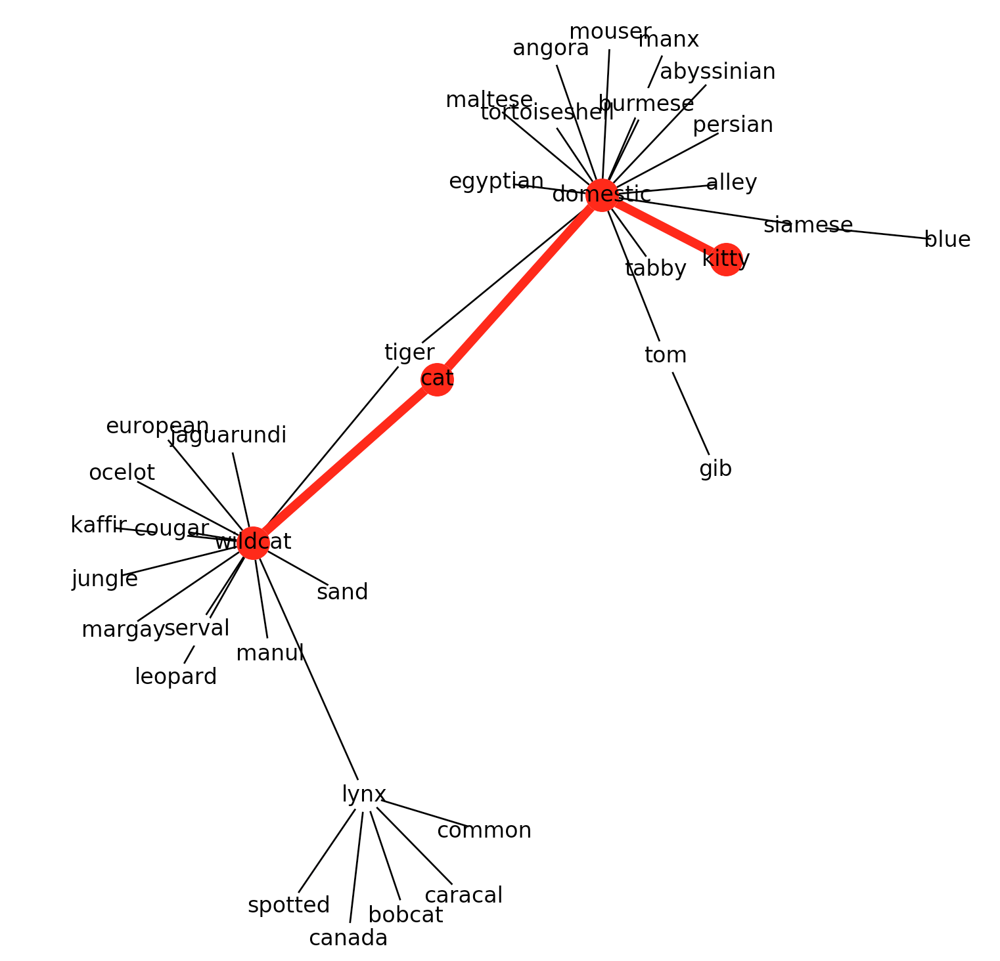
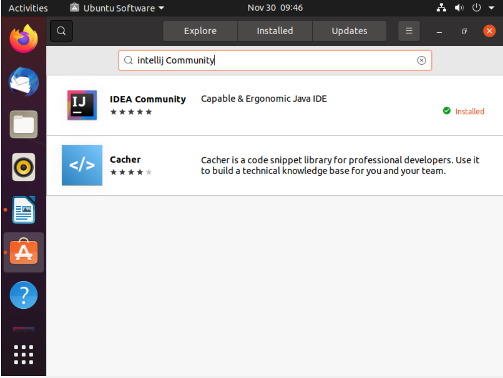
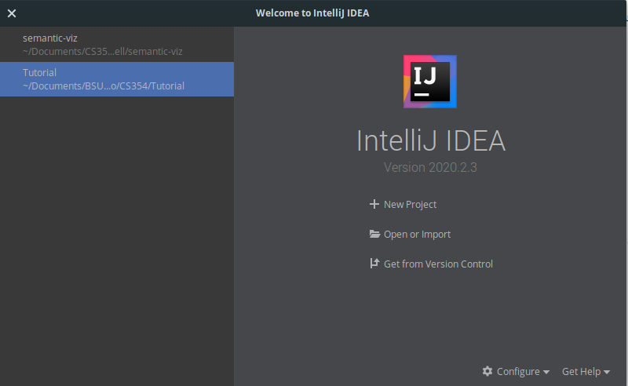
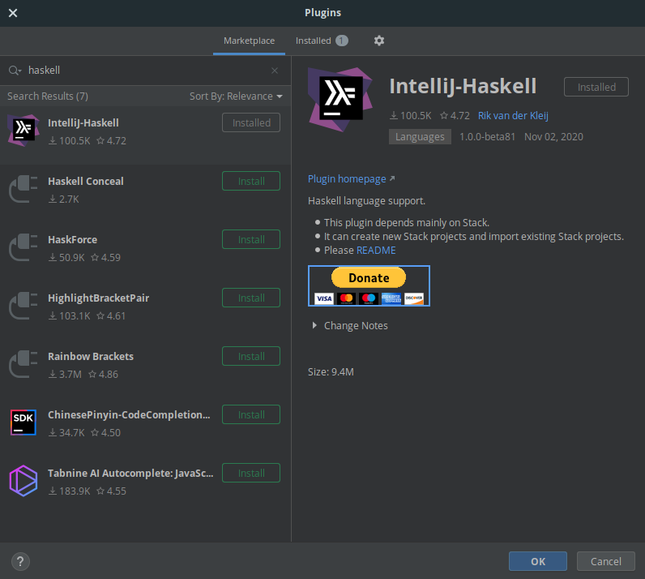
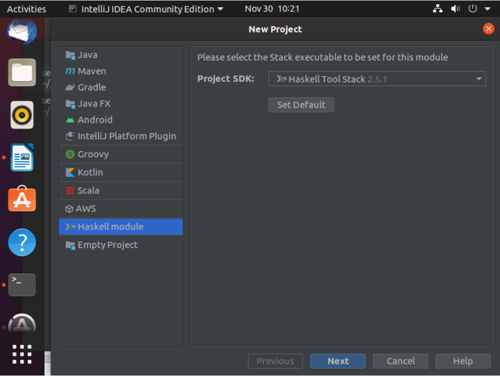
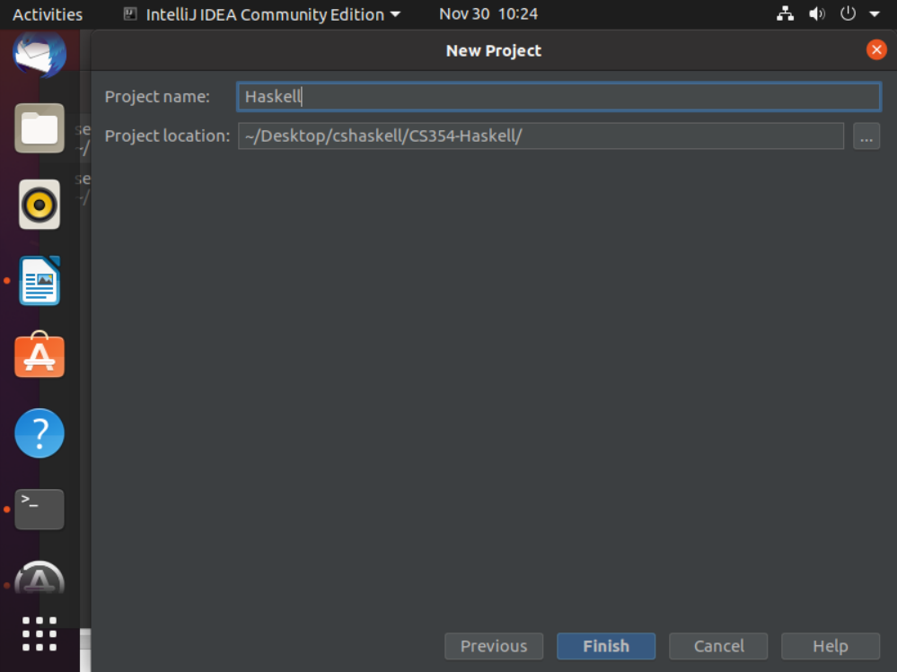
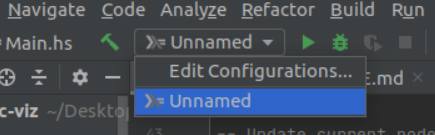
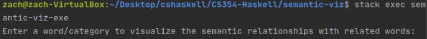

# Semantic Distance Visualizer written in Haskell

## Demo

## Project Setup
While their are many different routes to downloading and installing this project and its dependancies, we recomend downloading and installing a local VM: https://www.virtualbox.org/wiki/Downloads, with the Ubuntu operating system: https://ubuntu.com/download/desktop. Tips for installing this environment can be found here: https://brb.nci.nih.gov/seqtools/installUbuntu.html. 

After VM installation is complete download and install the following dependancies: 
  - the appropriate version of Wordnet: https://wordnet.princeton.edu/download/current-version
  - Haskell: `$ sudo apt-get install haskell-platform`
  - The Haskell Tool Stack: https://docs.haskellstack.org/en/stable/install_and_upgrade/
  - the most recent version of Python: https://www.python.org/downloads/source/
  - MatPlotlib: https://matplotlib.org/users/installing.html
  - NetworkX: https://networkx.org/documentation/stable/install.html
  - Intellij via Ubuntu Software
  - Haskell plugin for Intellij

**Example**  

To get Haskell working in IntelliJ you must first install the Haskell plugin.

Click the gear in the bottom right corner to configure IntelliJ

Click plugins and then search the marketplace for Haskell. Choose the plugin named IntelliJ-Haskell and click install

After installing the necessary dependancies, make sure to clone the repo `git clone https://github.com/aidanleuck/CS354-Haskell` to an appropriate folder. Then create a new project, with the Haskell Took Stack as the project SDK

Make sure the project location is the cloned repo

After the project has been created, make sure to click on Edit Configurations

Add the Haskell Stack to the configurations. Following, open a terminal in the semantic-viz folder and enter the command `build stack` to build the project and enter `stack exec semantic-viz-exe` to run the project.

Follow the prompts to run the program. It will prompt you for:

1. The word to query Wordnet for (hyponym)
2. The source word and target word you want to visualize the semantic distance between.

Follow the prompts to run the program. It will prompt you for:

1. The word to query Wordnet for (hyponym)
2. The source word and target word you want to visualize the semantic distance between.
