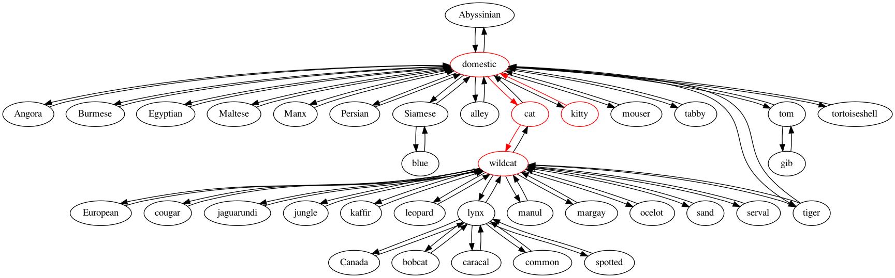

# Semantic Distance Visualizer written in Haskell

This project visualizes the semantic distance between 2 words in a given hyponym by querying the Wordnet lexical database. Wordnet is a large lexical database of English. Nouns, verbs, adjectives and adverbs are grouped into sets of cognitive synonyms (synsets), each expressing a distinct concept.

Next, the program parses the Wordnet output into an *adjacency list* representing an *undirected graph* of the semantic relationships between the words in the given hyponym. 

Finally, the *shortest path* between the source word and target word is computed and visualized for the user (see example screenshot below).

## Demo

In the example below, the semantic graph of hyponyms of "cat" is constructed, and the semantic distance (shortest path) between "kitty" and "wildcat" is computed.

### Visualization using Haskell + Graphviz

### Visualization using Python + Matplotlib

## Algorithm: Constructing the Semantic Graph

A tail-recursive algorithm dynamically constructs the adajacency list representing an undirected graph of the semantic relationships between words in the given hyponym. The algorithm can be summarized in the following steps:
  
 - Base case: If list of remaining words to be added to the adjacency list is empty, return the adjacency list.

 - Remove next element from list of words to be added. This element is a tuple containing the word and the associated number of leading spaces. The number of leading for the current word is compared to that of the previous word, and logical branching occurs based on the results of this comparison, which can result in 3 possible scenarios:

	- Case 1: the current line's number of leading spaces is greater than that of the previous line (i.e. we are going down a level in the Wordnet output hierarchy). In this case, the "parent" node will be the element at the top of the stack, and we add the current word as  neighbor to the parent node in the adjacency list. Finally, we push the current word to the stack, as it will potentially be the new parent for subsequent words.

	- Case 2: the current line's number of leading spaces is less than that of the previous line (i.e. we are going up a level in the Wordnet output hierarchy). In this case, we first pop the top element from the stack and discard it. Now the new top element of the stack contains the correct element we should add this new word as a neighbor to in the adjacency list. Finally, we push the current word to the stack, as it will potentially be the new parent for subsequent words. 

	- Case 3: the current line's number of leading spaces is equal to that of the previous line (i.e. we are still at the same level in the Wordnet output hierarchy). In this case, we first pop the top element from the stack. We had pushed this element to the stack previously in case the next line hits Case 1 (going down a level in the Wordnet hierarchy, which would use this element as the parent to add a word as a neighbor to in the adjacency list). However, since we are still at the same level, we pop this element and discard it, and now the new top element of the stack is the correct node we will be adding a neighbor to in the adjacency list. Finally, we push the current word to the stack, as it will potentially be the new parent for subsequent words. 

	- All possible cases end with a recursive call with an updated set of parameters after completing their operations (i.e. tail recursion).
  

 Below is an example of the data structures through the course of the algorithms execution while parsing the following Wordnet output:

 ### Wordnet Output
  

 ### Stack and Adjacency List step-by-step
  

## Algorithm: Computing the Shortest Path
To compute the shortest path, a standard breadth-first search algorithm is implemented in Haskell.

## Dependencies
- Tested on Ubuntu 20.0.4
- Wordnet: https://wordnet.princeton.edu/download/current-version
- Haskell: `$ sudo apt-get install haskell-platform`
- The Haskell Tool Stack: https://docs.haskellstack.org/en/stable/install_and_upgrade/
- Python 3.7+: https://www.python.org/downloads/source/

## Building and Executing
From the `semantic-viz` directory, run the command `stack build && stack exec semantic-viz-exe` to build and run the project.

Follow the prompts to run the program. It will prompt you for:

1. The word to query Wordnet for (hyponym)
2. The source word and target word you want to visualize the semantic distance between.

